<h3>
<code>saathvik@github ~ $ ./contributions.sh</code>
</h3>

   

<h3>
<code>saathvik@github ~ $ whoami</code>
</h3>

<table>
<tr>

<td width="50%" valign="top">

</td>

<td width="50%" valign="top">

</td>

</tr>
</table>

 

<code>saathvik@github ~ $ ls contact/</code>

  

<a href="https://github.com/saathvikmedavarapu2111-a11y"><code>GitHub</code></a>
&nbsp;&nbsp;•&nbsp;&nbsp;
<a href="https://www.linkedin.com/in/medavarapu-saathvik-68a189381/"><code>LinkedIn</code></a>
&nbsp;&nbsp;•&nbsp;&nbsp;
<a href="mailto:saathvikmedavarapu2111@gmail.com"><code>Email</code></a>

  

